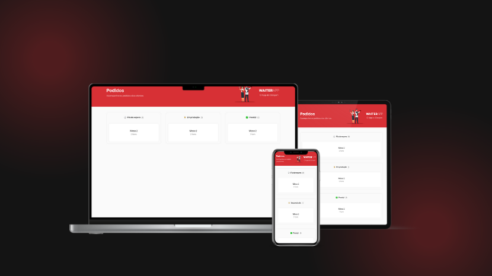

<p align="center">
  
</p>

<p align="center">
  

  

  
</p>

<h1 align="center">
    Waiter App Mobile
</h1>

<br>

## 🧪 Tecnologias

Este projeto foi desenvolvido utilizando as seguintes tecnologias:

- [Expo](https://expo.dev/)
- [Styled-Components](https://styled-components.com/)
- [TypeScript](https://www.typescriptlang.org/)
- [Git](https://git-scm.com/)

## 🚀 Executando projeto

Clone o projeto.

```bash
git clone https://github.com/Robson-Carvalho/waiter-app-mobile.git
```

Acsse a pasta do projeto clonado.

```bash
cd waiter-app-mobile
```

Execute o comando abaixo para baixar as dependências do projeto.

```bash
npm install
```

Execute o comando abaixo para rodar o projeto.

```
npm start
```

## 📖 Descrição do projeto

O Waiter-App-Mobile é um aplicativo móvel desenvolvido com a ajuda do framework Expo e da linguagem de programação TypeScript. Este aplicativo tem como objetivo principal ajudar os garçons e outros funcionários de restaurantes a gerenciar pedidos e atender clientes de maneira mais eficiente.

Com o uso do Expo, é possível desenvolver o aplicativo para iOS e Android com um único código base. Isso torna o desenvolvimento mais rápido e eficiente, economizando tempo e esforço dos desenvolvedores. Além disso, a utilização do TypeScript traz benefícios como maior segurança e facilidade de manutenção do código

## 📝 Licença

Este projeto está licenciado sob a licença MIT. Veja o arquivo [LICENSE](./LICENSE) para mais detalhes.

---

Feito com 💜 por [Robson Carvalho](https://portfolio-robson-carvalho.vercel.app/) 👋
